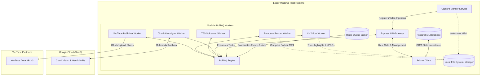
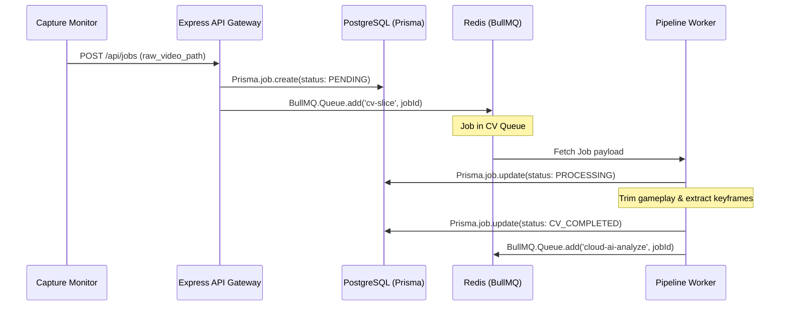

# System Architecture: Valorant AI Content Automation (Enterprise)

This document describes the high-availability, event-driven, modular architecture of the **Valorant AI Content Automation** platform.

---

## 1. System Topology (Event-Driven Hybrid Model)

The platform is designed as an **asynchronous, event-driven monorepo** using modular TypeScript services. It coordinates heavy, local file processing with cloud-based AI reasoning via a robust queuing mechanism.

---

## 2. Service Boundaries & Responsibilities

The system is split into distinct, isolated service boundaries. No service shares runtime context; they communicate exclusively via database models or event queues.

| Service Name            | Primary Responsibility                                                                                          | Input Channels                                 | Output Side Effects                                    |
| :---------------------- | :-------------------------------------------------------------------------------------------------------------- | :--------------------------------------------- | :----------------------------------------------------- |
| **Express API Gateway** | Core platform controller, system configuration, HTTP management endpoint, and webhook gateway.                  | HTTP REST, Admin UI.                           | PostgreSQL persistence, BullMQ job triggers.           |
| **Capture Monitor**     | Watches local directory changes. Non-blocking observer pattern.                                                 | Windows Filesystem notifications (`chokidar`). | Express API call / Enqueue Capture event.              |
| **CV Slicer Worker**    | Uses computer vision to identify multi-kills or scoreboard elements.                                            | BullMQ: `cv-slicer-queue`                      | Trims media files (FFmpeg), extracts action keyframes. |
| **Cloud AI Worker**     | Calls Cloud Vision & Gemini API to perform gameplay context analysis and commentary generation.                 | BullMQ: `cloud-ai-queue`                       | Generates title, description, tags, voice script JSON. |
| **TTS Voice Worker**    | Generates synthesized voice track and extracts precise syllable and word durations.                             | BullMQ: `tts-voice-queue`                      | Outputs voice MP3 and word-alignment JSON to storage.  |
| **Remotion Worker**     | Renders dynamic React video frames, overlaying player widgets, background music, and synced animated subtitles. | BullMQ: `video-render-queue`                   | Compiles finished vertical MP4 using local FFmpeg.     |
| **YouTube Publisher**   | Handles YouTube API chunked upload, secure local OAuth refresh-token rotation, and scheduling.                  | BullMQ: `publishing-queue`                     | Publishes daily Short, updates PostgreSQL states.      |

---

## 3. Communication Model (Redis & BullMQ Engine)

Services communicate using a **Producer-Consumer Model** coordinated via **Redis** and **BullMQ**. This ensures loose coupling, backpressure protection, and system resilience.

### I. Queue Pipeline & Event Sequences

1. **`Ingestion`**: The `Capture Monitor` detects a video file and sends an HTTP POST request to the `API Gateway`.
2. **`Persistence`**: The API Gateway uses `Prisma` to record a new `Job` with `status: PENDING` in the `PostgreSQL` database.
3. **`Enqueueing`**: The Gateway pushes a job payload to the `cv-slicer-queue` in Redis.
4. **`Sequential Execution`**: Each queue worker processes jobs sequentially. Upon completion of a task, the active worker updates the job model in PostgreSQL via Prisma, emits a completion event, and enqueues the next task payload in the subsequent pipeline queue (e.g., `cloud-ai-queue` -> `tts-voice-queue` -> `video-render-queue` -> `publishing-queue`).

---

## 4. Database Integration & ORM Layout

State persistence is managed via **Prisma ORM** pointing to a local or remote **PostgreSQL** database.

- **Type Safety**: Prisma generates precise TypeScript definitions from our schema file (`schema.prisma`), guaranteeing compile-time validation on all model updates across all modular services.
- **Relational Integrity**: Relational connections link `Jobs`, `Highlights` (CV extractions), `Metadata` (AI scripts/tags), and `Uploads` (YouTube tracking profiles).

---

## 5. Future Scalability

Although the system is optimized to execute locally on a single Windows gaming PC, its architecture is built for **Enterprise-Grade Horizontal Scalability**:

1. **Decoupled Render Fleets**: The `Remotion Worker` can easily be packaged into a separate Docker container and deployed on a cluster of cloud GPU machines (e.g., AWS EC2 G4 instances) if rendering volume scales beyond 1 video per day.
2. **Distributed Queue Managers**: Redis and BullMQ allow deploying multiple worker instances. If processing 100 channels, simply run multiple `Cloud AI` or `TTS` workers across various servers, keeping the heavy `Remotion` worker on dedicated rendering nodes.
3. **API Gateway Federation**: The Express-based API Gateway can be scaled horizontally behind a load balancer (e.g., NGINX or AWS ALB), storing user authentication and sessions inside PostgreSQL.

---

## 6. Deployment Strategy

- **Local Execution (Windows)**:
  - Run **PostgreSQL** and **Redis** locally using native Windows installations or lightweight background services.
  - Run modular services in background mode using **PM2** (Process Manager 2) for Node.js, ensuring automatic restarts on failure and unified log aggregation.
- **Production/Cloud Migration**:
  - The codebase can be containerized via Docker and deployed using Docker Compose or Kubernetes, connecting to Amazon RDS (PostgreSQL) and Amazon ElastiCache (Redis).
