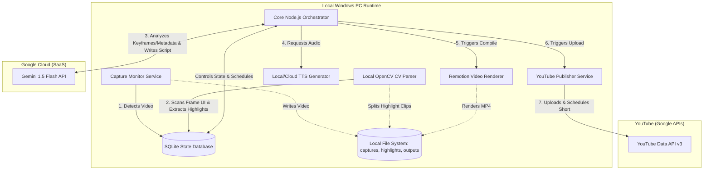
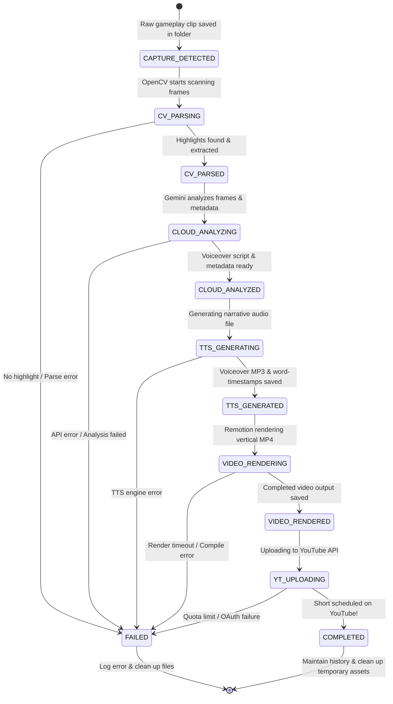

# System Architecture: Valorant AI Content Automation

This document outlines the system architecture, component topology, data flows, and state machine transitions for the **Valorant AI Content Automation** pipeline.

---

## 1. System Topology (Local-Hybrid Model)

To keep operating costs near zero and ensure compliance with anti-cheat software, the pipeline uses a **Local-Hybrid Topology**. Heavy compute tasks run locally on the creator's Windows machine, while lightweight AI inference is delegated to Cloud AI (Gemini).

---

## 2. Orchestration & Queue Model (SQLite State Machine)

To avoid complex message brokers like RabbitMQ or Redis, the orchestration uses a **Single-Worker Polling State Machine** backed by a local **SQLite database** (`state.db`).

### Why SQLite?
- **Zero-Setup**: Standard SQL database running out of a single file. Highly reliable, transaction-safe (ACID), and fully supported on Windows.
- **Concurrency Control**: A single-worker orchestrator reads and writes to the DB. Since video rendering (Remotion) and computer vision (OpenCV) are CPU/GPU-heavy, we **must** process jobs sequentially (Concurrency = 1) to prevent gaming performance degradation or system crashes. SQLite is the perfect fit.

### Job State Transitions
Each capture file enters the database as a "Job". The job transitions through the following states:

---

## 3. Detailed Data Flows

### Flow A: Local OpenCV Highlight Detection
1. **Capture Monitor** detects a new `.mp4` file in the configured captures directory. It writes a row in the `jobs` table (`status = 'CAPTURE_DETECTED'`).
2. **Orchestrator** picks up the job and moves it to `CV_PARSING`. It spins up the **CV Parser** (Python child process).
3. **CV Parser** reads the video frame-by-frame using OpenCV:
   - Scans the top-middle area for scoreboards.
   - Scans the bottom-middle area for kill skull overlays.
   - Detects the red/gold "Kill Skull" element.
   - Notes the timestamps where kills occurred.
4. If a multi-kill or clutch is found, the **CV Parser** slices the raw video into a 15–45 second clip around those timestamps (e.g., 10s before first kill, 5s after last kill) and saves it to `/highlights/`.
5. The **CV Parser** exits, reporting success and the highlight filepath. The orchestrator updates the job status to `CV_PARSED`.

### Flow B: Cloud AI Metadata & Script Generation
1. **Orchestrator** moves the job to `CLOUD_ANALYZING`.
2. To avoid uploading massive videos, the system extracts **5–10 keyframe images** (JPEG) representing the highlight's climax (kill feed triggers, ace banners) and collects metadata (kills count, agent played, map name).
3. **Orchestrator** sends a multimodal request containing these keyframes and metadata to the **Gemini 1.5 Flash API**:
   - Prompt requests:
     1. An engaging voiceover script (under 130 words for a < 60s Short).
     2. Stylized text overlays/captions.
     3. Video metadata (YouTube Title, Description, Tags, and relevant Hashtags).
4. **Gemini** returns a structured JSON response (schema-validated).
5. **Orchestrator** saves this JSON in the SQLite DB and transitions the job to `CLOUD_ANALYZED`.

### Flow C: Audio and Subtitle Synchronization
1. **Orchestrator** moves the job to `TTS_GENERATING` and calls the **TTS Generator**.
2. **TTS Generator** sends the voiceover script to the TTS engine (e.g., ElevenLabs or Edge-TTS) and requests:
   - The spoken audio file (MP3).
   - **Word-by-word timestamps** (crucial for Remotion to render frame-accurate animated subtitles).
3. The generator saves the MP3 to `/temp_audio/` and the word timestamps array to the database. Job status transitions to `TTS_GENERATED`.

### Flow D: Remotion Vertical Video Composition & Rendering
1. **Orchestrator** moves the job to `VIDEO_RENDERING` and invokes the **Remotion CLI** with the job's asset parameters:
   - Path to the sliced local highlight video.
   - Path to the TTS voiceover MP3.
   - Word timestamp JSON for subtitles.
   - Metadata (agent, score) to generate high-fidelity game-UI overlays.
2. **Remotion** builds a React composition:
   - Scales the 16:9 clip to a 9:16 portrait view, tracking the crosshair.
   - Positions game UI widgets at the top/bottom of the frame.
   - Draws dynamic, animated subtitles synchronized with the TTS audio using the timestamp JSON.
   - Integrates background music, ducking the volume during voiceover.
3. **Remotion** renders the React composition to a local MP4 file using FFmpeg and saves it to `/output/`.
4. Job transitions to `VIDEO_RENDERED`.

### Flow E: Secure YouTube Publishing
1. **Orchestrator** moves the job to `YT_UPLOADING` and invokes the **YouTube Publisher**.
2. **YouTube Publisher** reads the rendered vertical MP4 and the Gemini-generated metadata (Title, Description, Tags).
3. It uploads the video to the YouTube channel using the **YouTube Data API v3**:
   - Set as `private` or `unlisted` and scheduled to publish at a user-configured time (e.g., 10:00 AM daily).
   - Marked as a "Short" (guaranteed by vertical aspect ratio and `#Shorts` in title/description).
4. On success, the job moves to `COMPLETED`. The orchestrator executes cleanup scripts to remove large temporary files (`/captures/` and `/highlights/` after a retention threshold), preserving the system's disk health.

---

## 4. Reliability and Error Recovery

- **Atomic Transactions**: All database status transitions use transaction locks (`IMMEDIATE` in SQLite) to prevent race conditions.
- **Service Isolation**: If `video-renderer` crashes due to a syntax issue in a template, it does not crash the `capture-monitor` or the database. The orchestrator catches the crash, updates the job status to `FAILED`, saves the stack trace to the DB, and moves on to the next pending job.
- **Auto-Recovery on Restart**: At orchestrator boot, it scans the SQLite database for any jobs stuck in active states (`CV_PARSING`, `CLOUD_ANALYZING`, etc.). It automatically resets them back to `CAPTURE_DETECTED` or moves them to `FAILED` based on a configurable retry limit.
