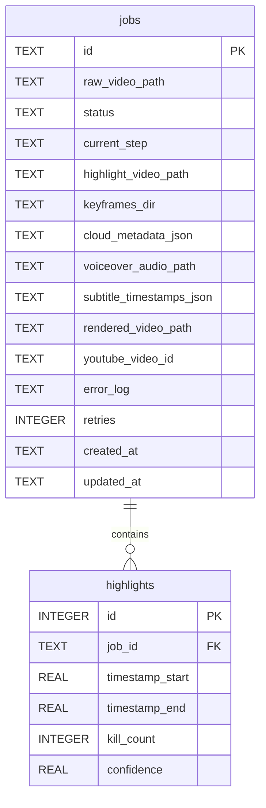

# Database Specification: Valorant AI Content Automation

This document outlines the SQLite database structure, table definitions, indexing strategies, and SQLite performance optimizations for the **Valorant AI Content Automation** local pipeline.

---

## 1. Database Architecture & Design

To keep the pipeline 100% self-contained and run on local Windows environments with zero dependency installation, we use a single file-based **SQLite** database (`/packages/database/state.db`).

### Optimizing SQLite for Local Concurrency
While SQLite is serverless, we can optimize its engine for rapid reading, writing, and locking safety by configuring specific database flags immediately upon connection:

1. **WAL Mode (Write-Ahead Logging)**:
   - **Command**: `PRAGMA journal_mode = WAL;`
   - **Justification**: Allows concurrent reads and writes. Prevents database write-locks from blocking orchestrator polls.
2. **Synchronous Mode**:
   - **Command**: `PRAGMA synchronous = NORMAL;`
   - **Justification**: Ensures data safety while reducing disk I/O bottlenecks.
3. **Busy Timeout**:
   - **Command**: `PRAGMA busy_timeout = 5000;`
   - **Justification**: Prevents sudden database lock errors by waiting up to 5 seconds for a lock to clear if multiple services access the file simultaneously.

---

## 2. Table Schemas

The database contains two main tables: `jobs` (for managing state transition steps) and `highlights` (for tracking isolated multi-kill elements).



### Table 1: `jobs`
Main pipeline coordinator table. Manages files and active statuses.

```sql
CREATE TABLE IF NOT EXISTS jobs (
    id TEXT PRIMARY KEY,                       -- UUID v4 or localized unique string
    raw_video_path TEXT NOT NULL,              -- Absolute path to raw file in /captures/
    status TEXT NOT NULL DEFAULT 'CAPTURE_DETECTED', -- CAPTURE_DETECTED, CV_PARSING, CV_PARSED, etc.
    current_step TEXT NOT NULL DEFAULT 'INIT', -- Tracking specific active step
    highlight_video_path TEXT,                 -- Path to sliced MP4
    keyframes_dir TEXT,                        -- Path to directory of JPEG keyframe extractions
    cloud_metadata_json TEXT,                  -- Stringified JSON matching Gemini response schema
    voiceover_audio_path TEXT,                 -- Path to generated TTS voice MP3
    subtitle_timestamps_json TEXT,             -- Stringified JSON array of WordTimestamp[]
    rendered_video_path TEXT,                  -- Path to finished vertical MP4
    youtube_video_id TEXT,                    -- Video identifier registered on YouTube
    error_log TEXT,                            -- Diagnostic stack trace on failure
    retries INTEGER NOT NULL DEFAULT 0,        -- Retry tracking count
    created_at TEXT NOT NULL,                  -- ISO 8601 string
    updated_at TEXT NOT NULL                   -- ISO 8601 string
);
```

### Table 2: `highlights`
Sub-table storing granular clips extracted from raw gameplay before synthesis.

```sql
CREATE TABLE IF NOT EXISTS highlights (
    id INTEGER PRIMARY KEY AUTOINCREMENT,
    job_id TEXT NOT NULL,                      -- Foreign key pointing to jobs.id
    timestamp_start REAL NOT NULL,             -- Slicing start time (seconds)
    timestamp_end REAL NOT NULL,               -- Slicing end time (seconds)
    kill_count INTEGER NOT NULL,               -- Total kills detected in this highlight window
    confidence REAL NOT NULL,                  -- Average OpenCV template matching certainty (0.0 - 1.0)
    FOREIGN KEY(job_id) REFERENCES jobs(id) ON DELETE CASCADE
);
```

---

## 3. Indexing Strategy

To speed up polling queries and garbage cleanup tasks, we apply target indexes on fields involved in filtering:

```sql
-- Speed up Orchestrator polls looking for incomplete/active jobs
CREATE INDEX IF NOT EXISTS idx_jobs_status ON jobs(status);

-- Speed up cleanup routines sorting old jobs to purge large media files
CREATE INDEX IF NOT EXISTS idx_jobs_created_at ON jobs(created_at);

-- Speed up highlights relational join querying
CREATE INDEX IF NOT EXISTS idx_highlights_job_id ON highlights(job_id);
```

---

## 4. Connection Helper Pattern (Node.js)

When initializing the database package, instantiate the SQLite connection using native bindings with optimization PRAGMAs pre-loaded.

```typescript
import Database from 'better-sqlite3';
import { ENV } from './config';

export function initializeDatabase() {
  const db = new Database(ENV.DB_PATH, { verbose: console.log });

  // Apply performance and safety configurations
  db.pragma('journal_mode = WAL');
  db.pragma('synchronous = NORMAL');
  db.pragma('busy_timeout = 5000');

  // Create tables & indexes
  db.exec(`
    CREATE TABLE IF NOT EXISTS jobs (...);
    CREATE TABLE IF NOT EXISTS highlights (...);
    CREATE INDEX IF NOT EXISTS idx_jobs_status ON jobs(status);
    CREATE INDEX IF NOT EXISTS idx_jobs_created_at ON jobs(created_at);
    CREATE INDEX IF NOT EXISTS idx_highlights_job_id ON highlights(job_id);
  `);

  return db;
}
```
*This initialization script guarantees that any fresh execution of the code auto-creates the database structure with full optimizations pre-applied.*
