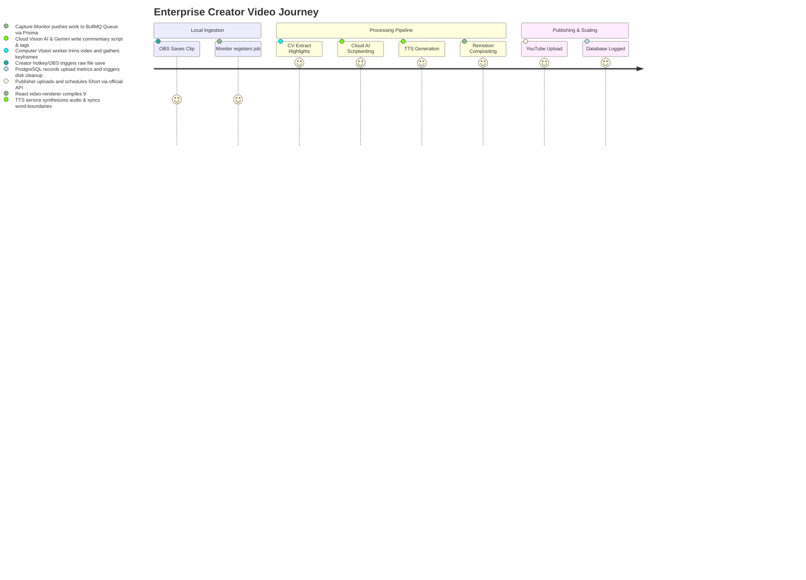

# Product Vision: Valorant AI Content Automation (Enterprise Edition)

This document outlines the product vision, target market, competitive advantages, and core workflows for the **Valorant AI Content Automation** platform.

---

## 1. Product Statement

### The Problem
Short-form content is the highest-engagement medium for gaming channels. Consistently publishing high-production-value YouTube Shorts requires hours of tedious work: sifting through gameplay, cropping 16:9 widescreen footage to 9:16 vertical, tracking crosshairs, writing narration scripts, generating voiceover audio, rendering overlays, and scheduling on YouTube. Creators who fail to post daily miss out on algorithmic channel growth.

### The Solution
A professional-grade, zero-click automation platform. By utilizing local GPU/CPU hardware for heavy operations (OpenCV CV Parsing, Remotion React-based Video Compositing, and FFmpeg compiling) and cloud-based AI (Cloud Vision AI & Gemini) for intelligent narration, scriptwriting, and SEO metadata, creators can automate their entire daily content pipeline.
- **The Creator Experience**: Play the game. Save clip. The system automatically extracts highlights, drafts an engaging story, generates realistic commentary, renders a vertical short with animated captions, and schedules it to YouTube.

---

## 2. Competitive Edge & Value Proposition

1. **Local-Hybrid Architecture**: Keeps server running costs extremely low (under **$0.05 per video**). No expensive cloud rendering GPU fleets are needed.
2. **Professional Aesthetics**: Unlike dry, standard text-to-speech video edits, the platform composites rich, vertical, crosshair-tracked gameplay overlaid with high-fidelity, custom-animated captions and game HUD tracking using **Remotion**.
3. **Robust Processing Engine**: Powered by **BullMQ**, **Redis**, and **PostgreSQL**, the pipeline handles queue processing, task concurrency, failover retries, and media storage safely on the Windows host.

---

## 3. Core Enterprise Workflows

---

## 4. Key Performance Indicators (KPIs)

- **Zero-Click Success Rate**: > 98% of captured clips must render and schedule on YouTube without manual correction.
- **Video Render Latency**: < 10 minutes for a complete, high-definition 60fps vertical Short compilation.
- **Resource Footprint**: Minimal overhead on the Windows host during gaming sessions, achieved by limiting background process concurrency.
- **Audience Engagement**: Standardized caption style increases short-form average watch duration (retention > 70%).
